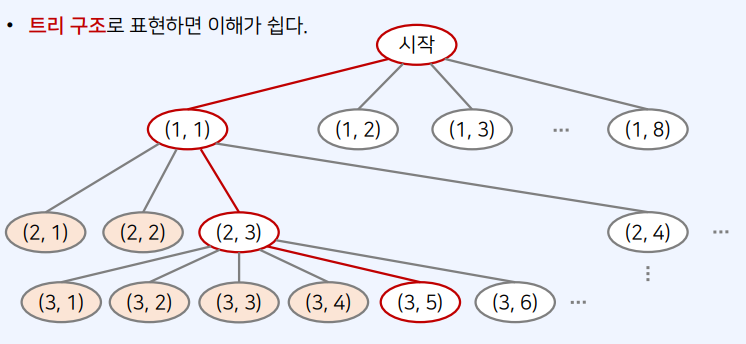
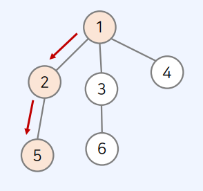

# 백트래킹

## 백트래킹이란 ?

- **일반적으로 그래프/트리의 모든 원소를 완전 탐색**하기 위한 목적
- 공부할 DFS와의 차이점
  1. DFS는 일반적으로 완전 탐색 목적으로, 재귀 함수를 이용해 구현한다.
  2. 백트래킹도 재귀 함수를 이용해 구현하는 것이 일반적이지만, **단순히 완전 탐색하는 것이 아니라 조건에 따라서 유망한 노드로 이동한다**

### N-Queen 문제를 이해하는 것이 백트래킹을 이해하는 첫걸음

#### N-Queen 문제

𝑁 × 𝑁 체스 보드 위에 퀸 𝑁개가 서로 공격할 수 없게 놓는 문제(행,열,대각선이 공격 범위)

- 예를 들어 𝑁 = 8이라고 해보자. 64개의 위치에 8개의 퀸을 설치하는 모든 조합의 수는 𝐶𝑜𝑚𝑏𝑖𝑛𝑎𝑡𝑖𝑜𝑛(64, 8)이다.
- 따라서 단순히 모든 경우의 수를 전부 고려한다면? 각 퀸이 서로 공격이 가능한지 검사하는 방식을 사용한다면 경우의 수가 매우 커질 수 있다.

#### 문제해결 아이디어

- 완전 탐색을 하더라도 유망한 경우에 대해서만 탐색을 진행 => 백트래킹 방식을 사용하여 훨신 경우의 수를 줄일 수 있다.

* 𝑁개의 퀸을 놓기 위해서는 각 행마다 1개씩의 퀸을 놓아야 한다.
* 1행부터 하나씩 퀸을 놓는다고 하면?
  - 1행에 놓을 수 있는 개수 8 = 2^3
  - 총 8행이니까 2^24
* 하나의 퀸 A가 이미 존재하는 상태에서, 다른 퀸 B를 놓으려면 어떻게 해야 할까?
  - 퀸 A의 **상하좌우 및 대각선 위치가 아닌 위치**에 퀸 B를 놓을 수 있다.
    - (행, 열) , 주황색은 놓지 못하는 곳, 하얀색은 놓을 수 있는 곳
      
* **이 문제는 가능한 모든 조합의 수**를 구하는 것과 같다
* 매 재귀함수마다 실제로 N\*N의 모든 위치를 모두 볼 필요가 없다.
* **[핵심]** 맨 처음 행부터 차례대로 퀸을 놓는다고 생각하면 가짓수를 훤씬 줄일 수 있다.
* N-Queen문제는 가능한 조합을 계산하는 것이므로, **현재 행의 이전 행**으로 돌아갈 필요가 없다.

* 백트래킹은 **모든 경우의 수**를 탐색하기에 적합하다.
* N-Queen 문제를 해결하기 위해서는 특정 위치(노드)의 **가능 여부를 판단**할 필요가 있다.
* 가능한 노드 여부는 다음의 두 가지를 보면 된다.
  > 1. 같은 행에 있는지 체크: 𝑥1 == 𝑥2 / 같은 열에 있는지 체크: 𝑦1 == 𝑦2
  > 2. 대각선에 있는지 체크: 𝑎𝑏𝑠(𝑥1 − 𝑥2) == 𝑎𝑏𝑠(𝑦1 − 𝑦2)

```

let n = 8; // 전체 맵(map)의 크기
let queens = []; // 현재 체스판에 놓인 퀸(queen)의 위치 정보들
function possible(x, y) {
  // (x, y) 위치에 퀸을 놓을 수 있는지 확인
  for (let [a, b] of queens) {
    // 현재까지 놓았던 모든 퀸(queen)의 위치를 하나씩 확인하며
    if (a == x || b == y) return false; // 행이나 열이 같다면 놓을 수 없음
    if (Math.abs(a - x) == Math.abs(b - y)) return false; // 대각선에 위치한 경우 놓을 수 없음
  }
  return true;
}
let cnt = 0;
function dfs(row) {
  if (row == n) cnt += 1; // 퀸(queen)을 N개 배치할 수 있는 경우 카운트
  for (let i = 0; i < n; i++) {
    // 현재 행(row)에 존재하는 열을 하나씩 확인하며
    if (!possible(row, i)) continue; // 현재 위치에 놓을 수 없다면 무시
    queens.push([row, i]); // 현재 위치에 퀸을 놓기
    dfs(row + 1); // 재귀 함수 호출
    queens.pop(); // 현재 위치에서 퀸을 제거하기
  }
}
dfs(0);
console.log(cnt);
```

### 백트래킹의 일반적인 코드 형태

```
function recursive() {
  if 종료 조건을 만족한다면 {
   처리;
  }
  for 자식 노드를 하나씩 확인하며 {
    if 임의의 조건을 만족한다면 {
      자식 노드 방문 처리;
      재귀 함수 recursive() 호출;
      자식 노드 방문 처리 해제;
    }
  }
}
```

- 루트 노드에서 자식 노드로 내려간다.
  
  (_출처 : 패스트캠퍼스 UPSKILL : Javascript 코딩테스트 131개 예제 & CS지식으로 끝내기_)

## 문제

- 15649 : N과 M (1) => 순열을 구하는 문제
  - 서로 다른 n개의 원소에서 r개를 **중복없이** 순서에 상관있게 선택하는 혹은 나열하는 것을 **순열**, **순서중요**
    > - 서로 다른 n개에서 r개를 순서대로 고르는 순열의 수는
    >
    > * nPr = n(n-1)(n-2)(n-3)....(n - r + 1)
  * 모든 순열의 수를 고려하기 위해 재귀 함수(백트래킹)를 사용
  * 원소를 **중복하여 선택하지 않으므로, 방문 처리(visited) 배열**을 사용한다.
