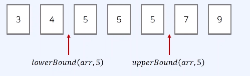
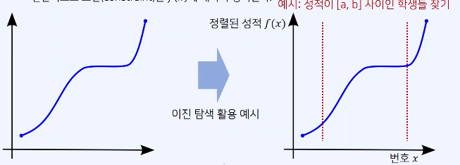

# 이진탐색알고리즘

## 이진 탐색

- 정렬되어 있는 리스트에서 탐색 범위를 절반씩 좁혀가며 데이터를 탐색한다.
- 시간복잡도 : O(logN)

* 이진 탐색을 수행할 때는 시작점(left)와 끝점(end)을 기준으로 탐색 범위를 명시한다.
* **기본적으로 정렬이 되어있는 상태에서 탐색을 함**
* 각 단계마다 탐색 범위를 2로 나누는 것으로 이해할 수 있다.
* 이상적인 경우 매 단계마다 범위가 반으로 감소하므로, 로그(log) 복잡도를 가진다.

## 대표적인 문제 유형

1. **매우 넓은(억 단위 이상) 탐색 범위**에서 최적의 해를 찾아야 하는 경우
2. 데이터를 정렬한 뒤에 다수의 쿼리를 날려야 하는 경우 => 정렬 이후에 어떠한 원소의 존재여부를 찾는 과정과 같은.. ?

### 정렬된 배열에서 특정 원소의 개수 구하기

- 코딩 테스트에서 자주 등장함

#### 하한선과 상한선 함수

- 이진 탐색 함수로 lowerBound, upperBound가 있는 데 c++에서 제공하지만 java, javascript에선 제공 안함.
- **lowerBound(arr, x)** : 정렬된 순서를 유지하면서 배열 arr에 x를 넣을 가장 왼쪽 인덱스를 반환
- **upperBound(arr, x)** : 정렬된 순서를 유지하면서 배열 arr에 x를 넣을 가장 오른쪽 인덱스를 반환
  
  (_출처 : 패스트캠퍼스 UPSKILL : Javascript 코딩테스트 131개 예제 & CS지식으로 끝내기_)

#### 자바스크립트에서 lowerBound, upperBound, countByRange 구현

```

function lowerBound(arr, target, start, end) {
  while(start < end) {
    let mid = parseInt((start + end) / 2);
    if(arr[mid] >= target) end = mid; // 최대한 왼쪽으로 이동하기, 동일 값이 여러개라면 값을 찾은 상태에서 최대한 왼쪽으로
    else start = mid + 1;
  }
  return end;
}

function upperBound(arr, target, start, end) {
  while(start < end) {
    let mid = parseInt((start + end) / 2);
    if(arr[mid] > target) end = mid;
    else start = mid + 1; // 최대한 오른쪽으로 이동하기, 동일 값이 여러개라면 값을 찾은 상태에서 최대한 오른쪽으로
  }
  return end;
}

```

- countByRange
  - 정렬된 배열에서 **값이 특정 범위에 속하는 원소의 개수를 계산**한다.
  - lowerBound, upperBound 이용

```

function countByRange(arr, leftValue, rightValue) {
  let rightIndex = upperBound(arr, rightValue, 0, arr.length);
  let leftIndex = lowerBound(arr, leftValue, 0, arr.length);
  return rightIndex - leftIndex;
}
```

### 파라메트릭 서치 이해하기

- 이진 탐색의 예시로 자주 언급되는 기본적인 이진탐색 활용 아이디어 중 하나

* 다른 고급 알고리즘과 연계되어 난이도 높은 문제로 종종 출제됨.

#### 이진 탐색 조건

- 변경할(최적화할) 값 x에 대하여 f(x)가 단조 증가 혹은 단조 감소

* 단조 증가 함수 : x <= y 이면 f(x) <= f(y)인 경우

- **단조 증가란** : 비내림차순을 의미, 즉 오른쪽값일 수록 왼쪽보다 크거나 같다는 의미, 계단 형식이던, 가파르게 올라가던

* 일반적으로 조건(constraint)은 f(x)에 대하여 정의된다.
  
  (_출처 : 패스트캠퍼스 UPSKILL : Javascript 코딩테스트 131개 예제 & CS지식으로 끝내기_)

- 위 이미지에서 성적이 a,b 사이인 학생을 찾는다고하면 위 그래프와 같이 단조증가인 경우 찾을 수 있다.
- 이때 x는 학생의 번호, f(x)는 번호가 x인 학생의 성적이라고 하면 번호에 따라서 이미 성적이 정렬이 되어 있다고 가정한다.
- 즉, 학생들의 번호에 따라서 성적이 정렬되어 있다고 하면 위 그래프와 같은 단조증가 함수형태를 띈다.
- 이 경우 만약 탐색 범위를 설정한다고 했을 때 왼쪽에 있는 f(x)는 항상 값이 작게된다. 즉, 항상 중앙을 기준으로 큰값 작은값으로 쪼갤 수 있기 때문에 이진탐색 진행 가능

#### 파라메트릭 서치란 ?

- **최적화 문제를 결정 문제('예' 혹은 '아니오')로 바꾸어 해결하는 기법**
  - 예시 : 특정한 조건(예를 들어 최대값, 최소값)을 만족하는 가장 알맞은 값을 빠르게 찾는 최적화 문제
    > 학생 번호 = x, 특정 학생을 입력으로 넣었을 때 그에 따른 성적 = f(x)이고 f(x)가 단조 감소 함수일 경우 , 이때 성적이 70점 이상인 학생을 찾아보자. 다만, 학생의 번호가 가장 큰 것을 찾기를 원한다. 이러한 문제가 전형적인 예시 중 하나이다.

* 일반적으로 코테에서 파라메트릭 서치 문제는 **이진 탐색을 이용하여 해결**할 수 있다.

## 문제

- 2512 : 예산(이진탐색, 파라메트릭 서치)

* 2805 : 나무자르기
