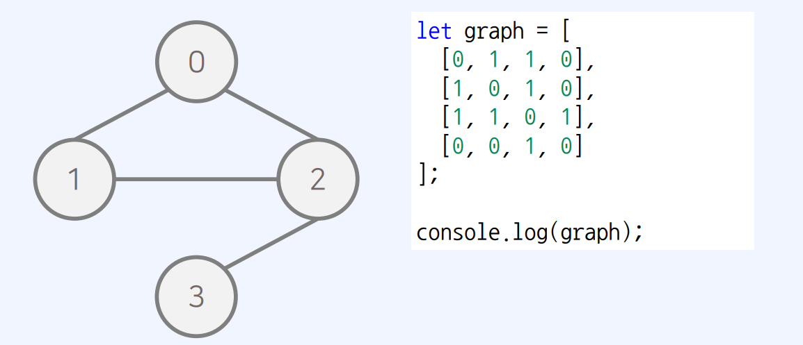
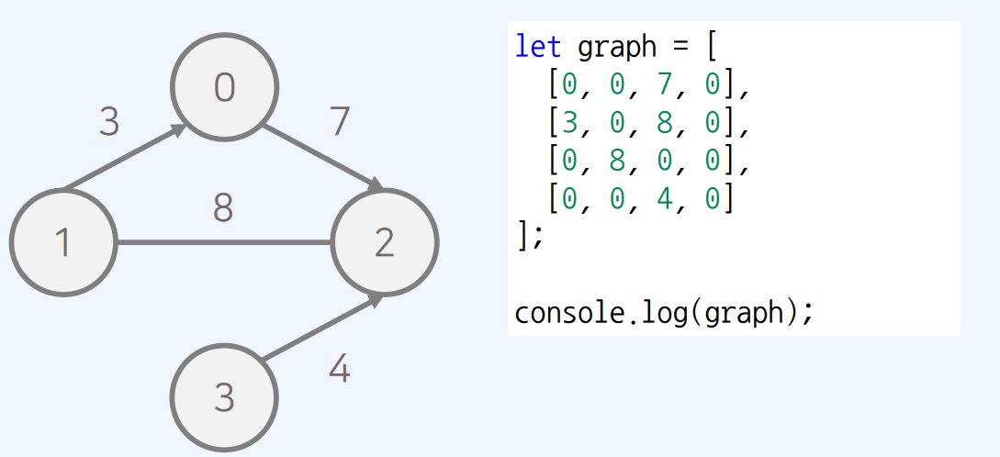
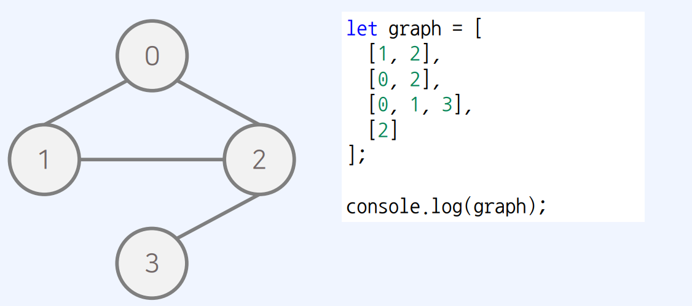
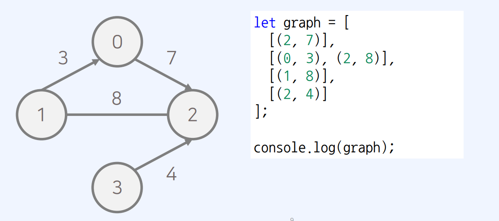

# 자바스크립트 자료구조

(이미지, 내용 출처 : 패스트캠퍼스 javascript 코딩테스트&자료구조 강의)

## 자료구조의 종류

### 선형 구조

- 하나의 데이터 뒤에 다른 데이터가 하나 존재, 순차적 연결

### 종류

- 배열 : Javascript에서 일반 배열로 구현
- 연결리스트 : 실제로 Javascript로 구현해야하는 경우 적음.
- 스택 : Javascript에서 일반 배열로 구현

- 큐 : JavaScript에서는 Dictionary 자료형을 이용하여 큐(queue)를 구현하면 간단

  ```
     class Queue {


          constructor() {
            this.items = {};
            this.headIndex = 0;
            this.tailIndex = 0;
          }
          enqueue(item) {
            this.items[this.tailIndex] = item;
            this.tailIndex++;
          }
          dequeue() {
            const item = this.items[this.headIndex];
            delete this.items[this.headIndex];
            this.headIndex++;
            return item;
          }
          peek() {
           return this.items[this.headIndex];
          }
          getLength() {
           return this.tailIndex - this.headIndex;
          }
   }
  ```

  ```

          // 구현된 큐(Queue) 라이브러리 사용
          queue = new Queue();
          // 삽입(5) - 삽입(2) - 삽입(3) - 삽입(7)
          // - 삭제() - 삽입(1) - 삽입(4) - 삭제()
          queue.enqueue(5);
          queue.enqueue(2);
          queue.enqueue(3);
          queue.enqueue(7);
          queue.dequeue();
          queue.enqueue(1);
          queue.enqueue(4);
          queue.dequeue();

  ```

### 비선형 구조

- 하나의 데이터 뒤에 다른 데이터가 여러 개 올 수 있음

### 종류

- 트리
- 그래프

  - 인접 행렬 : 2차원 배열을 사용하는 방식

    - 시간 복잡도
      - 필요한 메모리 : O(V^2)
      - 연결여부 확인 : O(1)

    * 무방향 비가중치 그래프

      > - 모든 간선 방향성 가지지 않는 그래프 => 무방향 그래프
      > - 모든 간선 가중치 없는 그래프 => 무가중치 그래프
      > - 무방향 비가중치 그래프 주어졌을 때 아래처럼 출력 가능
      >   

    - 방향 가중치 그래프
      > - 모든 간선 방향을 가지는 그래프 => 방향 그래프
      > - 모든 간선 가중치 있는 그래프 => 가중치 그래프
      >
      > * 방향 가중치 그래프가 주어졌을 때 아래처럼 출력 가능
      >   

  - 인접 리스트 : 연결 리스트를 이용하는 방식, 그래프를 리스트로 표현

    - 시간 복잡도
      - 필요한 메모리 : O(V + E) => 연결된 간선 수(E)만큼 +
      - 연결여부 확인 : O(V) => 연결된 간선을 모두 확인해야 함으로
    - 무장향 비가중치 그래프
      > 

    * 방향 가중치 그래프

      > 

    * 최단 경로 알고리즘 => 각각 근처의 노드와 연결되어 있는 경우가 많으므로, 간선 개수가 적어 인접 리스트가 유리

## 프로그램의 성능 측정 방법

- 시간 복잡도 : 알고리즘에 사용되는 **연산 횟수**를 측정한다
- 공간 복잡도 : 알고리즘에 사용되는 **메모리 양**을 측정

* 공간을 많이 사용하는 대신 시간을 단축하는 방법이 흔히 사용됨.
* **Big-O표기법 : 가장 빠르게 증가하는 항만 고려함.**
* 아래 알고리즘은 O(n)의 시간 복잡도를 가짐.
  - 아래 변수들 중에 어떤 변수가 가장 시간에 큰 영향을 미칠까? => n의 수가 커지면 커질 수록 for 문이 돈다. n에 비례하는 만큼 연산 횟수가 증가
* **연산횟수가 10억(1,000,000,000)을 넘어가면 1초 이상의 시간이 소요된다.**

```
let n = 0;
let summary = 0;
for (let i = 0; i< n; i++) {
  summary += i;
}
console.log(summary);
```

- _이미지의 모든 출처 => 패스트캠퍼스 UPSKILL : Javascript 코딩테스트 131개 예제 & CS지식으로 끝내기_
