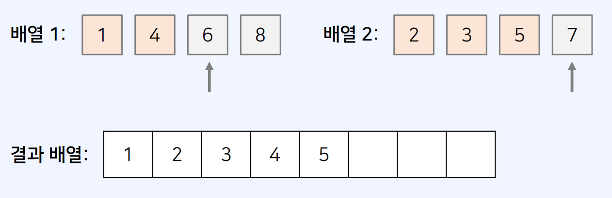

## 정렬

### 선택 정렬

- 매 단계에서 가장 작은 원소를 선택해서 앞으로 보내는 정렬 방법

* 동작 방식
  1. 각 단계에서 가장 작은 원소를 선택한다.
  2. 현재까지 처리되지 않은 원소들 중 가장 앞의 원소와 위치를 교체한다.
* 시간 복잡도
  - 결과적으로 약 𝑁개의 단계를 거친다는 점에서 최악의 경우 𝑂(N^2) 의 시간 복잡도

```
  // 선택 정렬 함수
function selectionSort(arr) {
  for (let i = 0; i < arr.length; i++) {
    let minIndex = i; // 가장 작은 원소의 인덱스
    for (let j = i + 1; j < arr.length; j++) {
      if (arr[minIndex] > arr[j]) {
      minIndex = j;
    }
    }
    // 스와프(swap)
    let temp = arr[i];
    arr[i] = arr[minIndex];
    arr[minIndex] = temp;
  }
}
```

### 버블 정렬

- 각 단계에서는 인접한 두 개의 원소를 비교하여, 필요시 위치를 변경
- 동작 방식
  - 첫째와 둘째를 비교, 둘째와 셋째를 비교, 셋째와 넷째를 비교하는 방식
  * 한 번의 단계가 수행되면, 가장 큰 원소가 맨 뒤로 이동
  * 따라서, 그 다음 단계에서는 맨 뒤로 이동한 데이터는 정렬에서 제외한다.
  * **각 단계를 거칠 때마다 가장 큰 값을 하나씩 확실하게 결정하는 것**

* 시간 복잡도
  - 최악의 경우 O(N^2)

```
// 버블 정렬 함수
function bubbleSort(arr) {
  for (let i = arr.length - 1; i > 0; i--) {
    for (let j = 0; j < i; j++) {
      if (arr[j] < arr[j + 1]) { // 내림차순 예시
        let temp = arr[j];
        arr[j] = arr[j + 1];
        arr[j + 1] = temp;
      }
    }
  }
}

```

### 삽입 정렬

- 각 원소를 적절한 위치에 삽입하는 정렬 기법
- 동작 방식
  1. 각 단계에서 현재 원소가 삽입될 위치를 찾는다.
  2. 적절한 위치에 도달할 때까지 반복적으로 왼쪽으로 이동한다

* 시간 복잡도

  - 최악의 경우 O(N^2)

* **삽입 정렬을 수행할 때는 처음에 첫 번째 원소는 정렬이 되어 있다고 고려한다**

```
// 삽입 정렬 함수
function insertionSort(arr) {
  for (let i = 1; i < arr.length; i++) {
    for (let j = i; j > 0; j--) {
      // 인덱스 j부터 1까지 1씩 감소하며 반복
      if (arr[j] < arr[j - 1]) {
        // 한 칸씩 왼쪽으로 이동
        // 스와프(swap)
        let temp = arr[j];
        arr[j] = arr[j - 1];
        arr[j - 1] = temp;
      } else {
        // 자기보다 작은 데이터를 만나면 그 위치에서 멈춤
        break;
      }
    }
  }
}

```

### 병합 정렬

- 병합 정렬은 전형적인 분할 정복(divide and conquer) 알고리즘

* **분할 정복**

  1. 분할(divide): 큰 문제를 작은 부분 문제(쉬운 문제)로 분할한다.
  2. 정복(conquer): 작은 부분 문제를 각각 해결한다.
  3. 조합(combine): 해결한 부분 문제의 답을 이용하여 다시 큰 문제를 해결한다

  - 분할 정복은 일반적으로 재귀 함수를 이용하여 구현한다. => 함수 호출 횟수가 많이 발생함으로 오버헤드로 이어질 수 있다.
  - 더 이상 쪼갤 수 없는 크기가 될 때까지 계속하여 분할한다

- 동작 방식

  - 분할(Divide): 분할 작업은 단순히 배열의 크기를 절반으로 쪼개는 것이다.
  - 정복(Conquer): 두 개의 부분 배열을 “정렬된 하나의 배열”로 만든다.

  * 각 부분 배열은 이미 정렬된 상태로 본다.
  * 각 부분 배열에 대해 첫째 원소부터 시작하여 하나씩 확인한다.
    

* 시간 복잡도

  - 최악의 경우 O(NlogN)을 보장하는 빠른 정렬 알고리즘 중 하나

* 장점: 최악의 경우에도 𝑂 𝑁𝑙𝑜𝑔𝑁 을 보장할 수 있다는 점에서 효율적이다.
* 단점: 일반적인 경우, 정복(conquer) 과정에서 임시 배열이 필요하다

```
// 병합(merge) 수행 함수
function merge(arr, left, mid, right) {
  let i = left; //왼쪽 배열 인덱스
  let j = mid + 1; //오른쪽 배열 인덱스
  let k = left; // 결과 배열의 인덱스
  while (i <= mid && j <= right) {
    if (arr[i] <= arr[j]) sorted[k++] = arr[i++];
    else sorted[k++] = arr[j++];
  }
  // 왼쪽 배열에 대한 처리가 다 끝난 경우, 오른쪽 나머지값들 결과 배열에 추가
  if (i > mid) {
    for (; j <= right; j++) sorted[k++] = arr[j];
  }
  // 오른쪽 배열에 대한 처리가 다 끝난 경우, 왼쪽 나머지값을 결과 배열에 추가
  else {
    for (; i <= mid; i++) sorted[k++] = arr[i];
  }
  // 정렬된 배열 결과를 원본 배열에 반영하기
  for (let x = left; x <= right; x++) {
    arr[x] = sorted[x];
  }
}

```

```
// 병합 정렬(merge sort) 함수
// 인자 값 : arr, 0, arr.length - 1
function mergeSort(arr, left, right) {
  // 원소가 1개인 경우, 해당 배열은 정렬이 된 상태로 이해 가능
  if (left < right) {
    // 원소가 2개 이상이라면
    let mid = parseInt((left + right) / 2); // 2개의 부분 배열로 분할(divide)
    mergeSort(arr, left, mid); // 왼쪽 부분 배열 정렬 수행(conquer)
    mergeSort(arr, mid + 1, right); // 오른쪽 부분 배열 정렬 수행(conquer)
    merge(arr, left, mid, right); // 정렬된 2개의 배열을 하나로 병합(combine)
  }
}

```

### 자바스크립트 정렬 라이브러리

- sort() : 최악의 경우에도 시간복잡도 O(NlogN)을 보장, 알고리즘 및 코딩 테스트 문제 해결할 때 정렬 기능이 필요하다면 단순히 sort()함수 사용하는 거 권장, **sort사용 시 항상 정렬 기준 함수 명시**하는 습관 필요

## 문제

- 1427 : 소트인사이드
- 10814 : 나이순 정렬
